# WhatsApp-Chat-Analyzer
### Title: WhatsApp Chat Analyzer with Sentiment Analysis  
##### Description: The WhatsApp Chat Analyzer is a Python-based project designed to provide insights into the sentiment of conversations within WhatsApp chats. Leveraging the power of natural language processing and sentiment analysis techniques, this tool allows users to gain valuable insights into the emotional tone of their conversations.

# Working of Project

## Main Page
The user interface of the web application is built using Streamlit. Streamlit is a freely available, open-source Python library that enables users to develop interactive web applications for tasks in data science and machine learning.
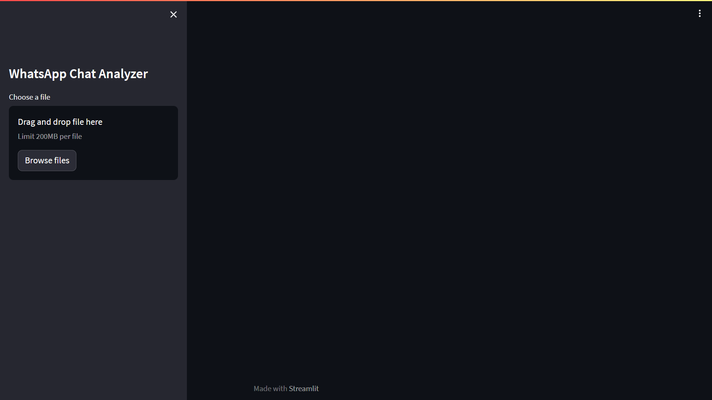

## Uploading a Chat File
In the second step, users have the option to upload a chat either from an individual or a group conversation. The chat file must be in .txt format and should not contain any media. Additionally, the time format within the chat should follow the 24-hour convention.
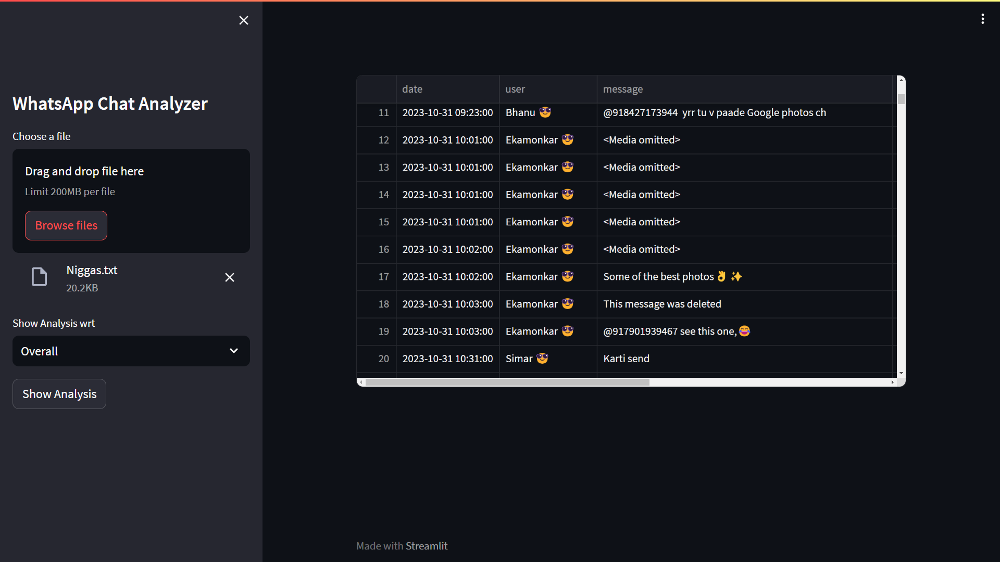

### We can analyze the Chat at both group level and the user level 

## Analysis
Clicking on the 'Show Analysis' button will display a range of statistics and plots. These visuals offer insights and data that can be derived from the analysis. The following list outlines the various inferences and information that can be drawn from these plots:

### Overall Statistics
View key statistical metrics summarizing the entire chat.
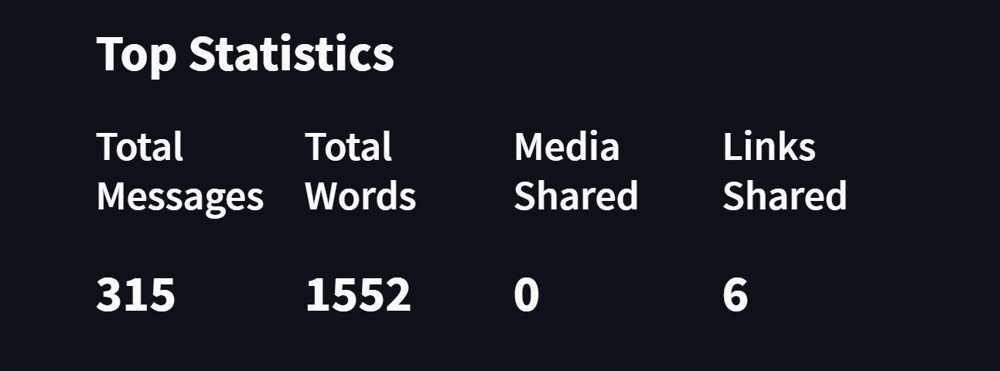

### Monthly Statistics Timeline
Track chat activity trends over the course of months.
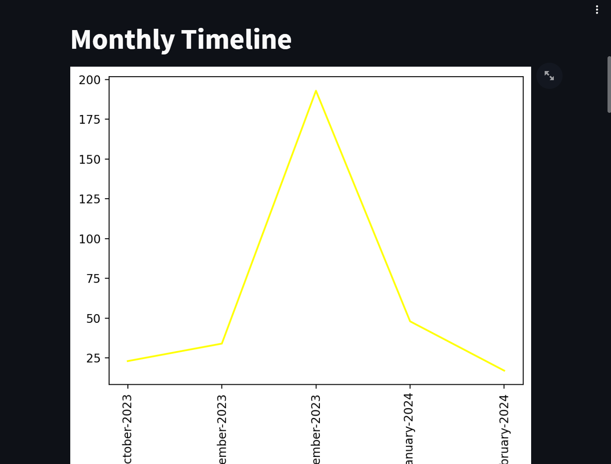

### Daily Statistics Timeline
Explore day-to-day variations in chat engagement.
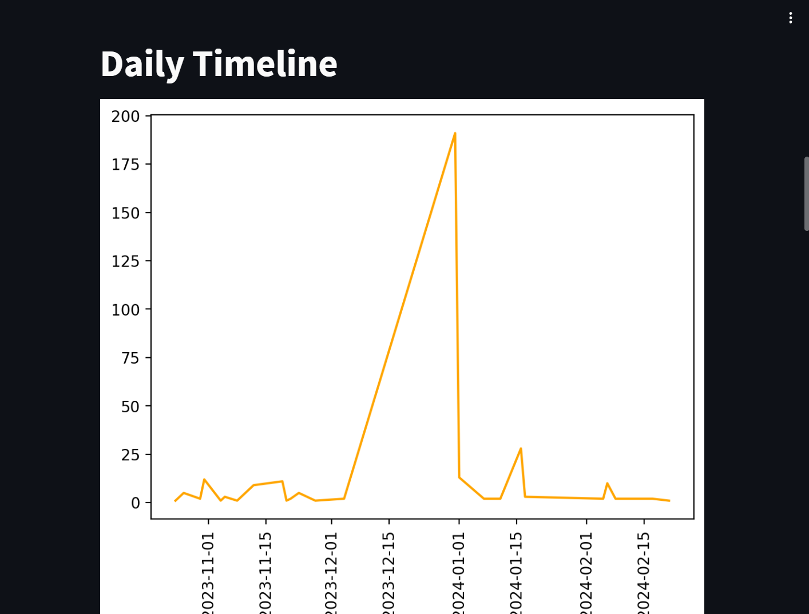

### Activity Map (Day & Month)
Visualize chat activity patterns across both days and months.
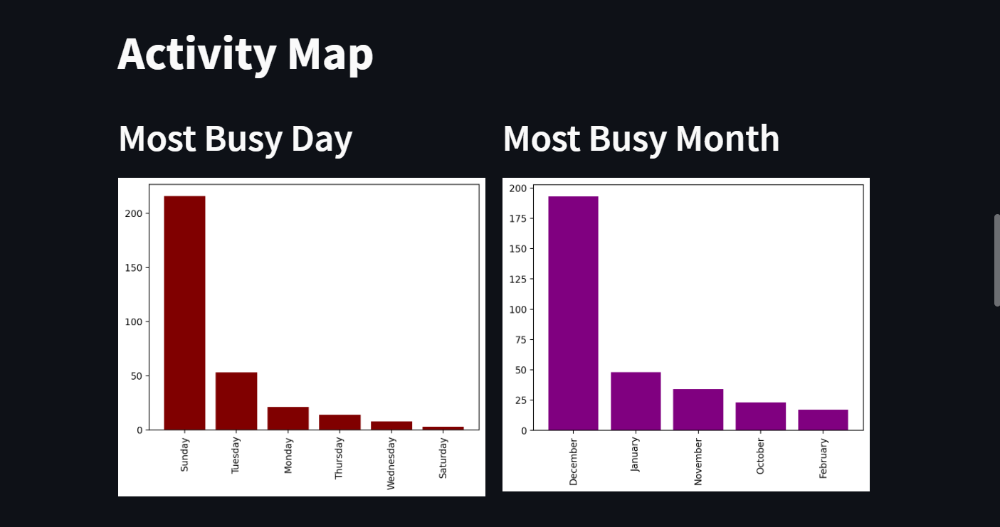

### Activity Map (Weekly)
Examine weekly patterns of chat interaction.
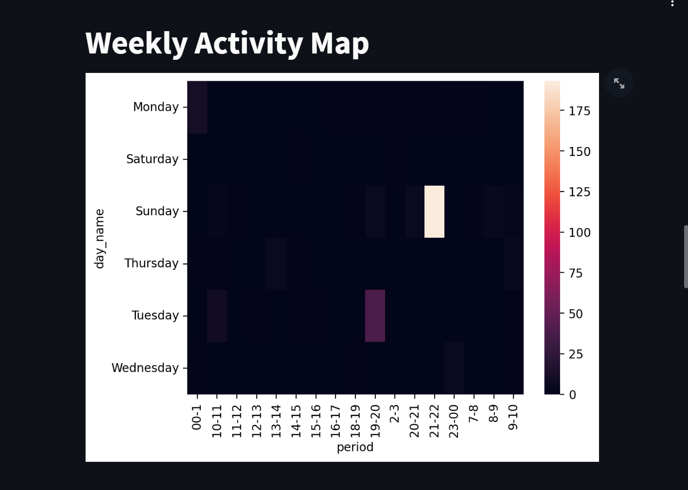

### User Contribution
Analyze individual users' contributions to the chat.
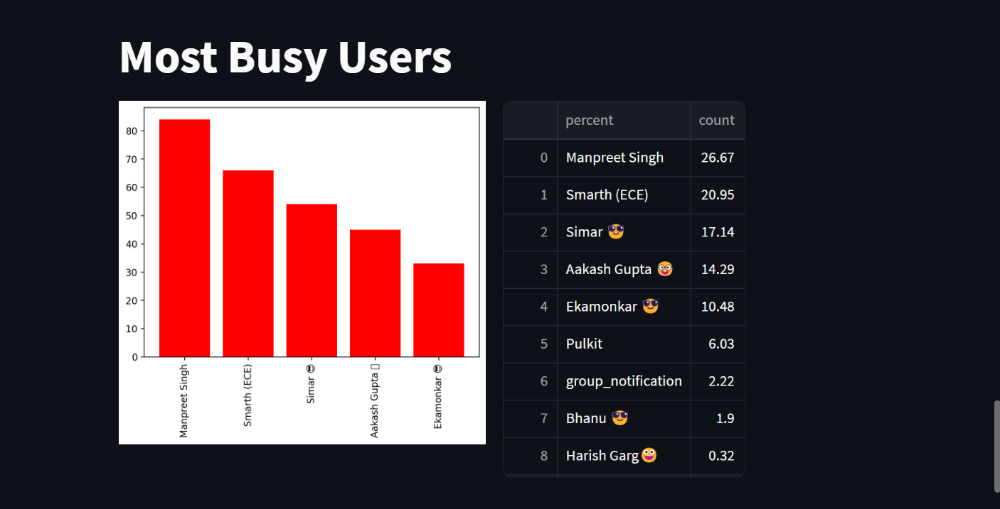

### WordCloud
Visual representation of frequently used words in the chat.
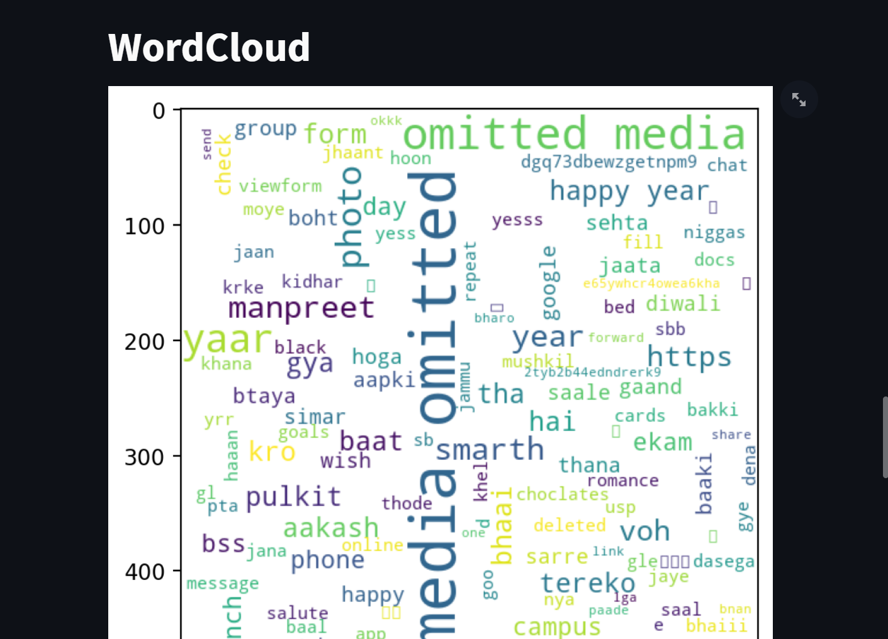

### Commonly used words
Identify the most commonly used words in the chat.
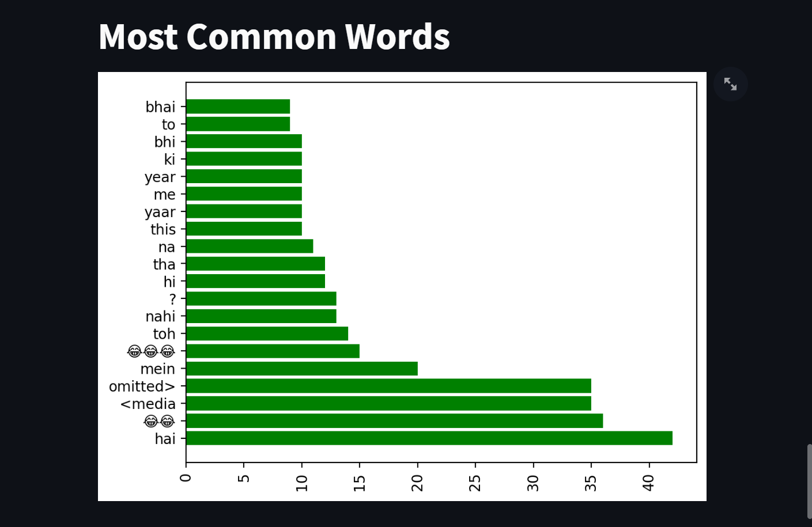

### Emoji Analysis
Explore the usage patterns of emojis within the chat.
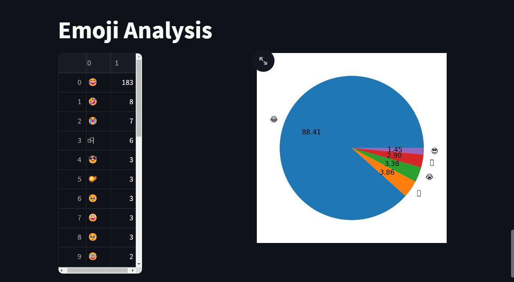

### Code Run
To Run the Code clone the repository. Open the Project in any editor e.g. VSCode, PyCharm etc.
Install required Dependencies.
#### Run the command: streamlit run ./app.py